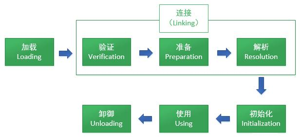
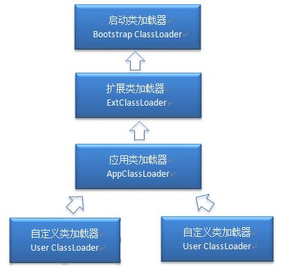

# java类的加载机制
* 类的加载
> 类的加载指的是将类的.class文件中的二进制数据读入到内存中，将其放在运行时数据区的方法区内，然后在堆区创建一个java.lang.Class对象，用来封装类在方法区内的数据结构。
类的加载的最终产品是位于堆区中的Class对象，Class对象封装了类在方法区内的数据结构，并且向Java程序员提供了访问方法区内的数据结构的接口。
* 类的生命周期  
> 从类被加载到虚拟机内存中开始，到卸御出内存为止，它的整个生命周期分为7个阶段，加载(Loading)、验证(Verification)、准备(Preparation)、解析(Resolution)、初始化(Initialization)、使用(Using)、卸御(Unloading)。其中验证、准备、解析三个部分统称为连接。
  7个阶段发生的顺序如下：
  
  
>   * 加载
>   > 1.    通过一个类的全限定名来获取定义此类的二进制字节流。
>   > 2.    将这个字节流所代表的静态存储结构转化为方法区的运行时数据结构。
>   > 3.    在内存中生成一个代表这个类的java.lang.Class对象，作为方法区这个类的各种数据的访问入口。
>   > 4.    注意：JVM中的ClassLoader类加载器加载Class发生在此阶段

>   * 验证
>   > 1.    文件格式验证：验证字节流是否符合Class文件格式的规范；例如：是否以0xCAFEBABE开头、主次版本号是否在当前虚拟机的处理范围之内、常量池中的常量是否有不被支持的类型。
>   > 2.    元数据验证：对字节码描述的信息进行语义分析（注意：对比javac编译阶段的语义分析），以保证其描述的信息符合Java语言规范的要求；例如：这个类是否有父类，除了java.lang.Object之外。
>   > 3.    字节码验证：通过数据流和控制流分析，确定程序语义是合法的、符合逻辑的。
>   > 4.    符号引用验证：确保解析动作能正确执行。

>   * 准备
>   > 准备阶段正式为类变量分配内存并设置初始值阶段。 public static int value=123; 初始后为 value=0;
>   > 对于static final类型，在准备阶段会被赋予正确的值  public static final value=123;初始化为 value=123;
>   > 如果是boolean值默认赋值为：false
>   > 如果是对象引用默认赋值为：null 
>   > * 注意：只设置类中的静态变量（方法区中），不包括实例变量（堆内存中），实例变量是在对象实例化的时候初始化分配值的。

>   * 解析
>   > 解析阶段是虚拟机将常量池内的符号引用替换为直接引用的过程。
>   > 1.    符号引用：简单的理解就是字符串，比如引用一个类，java.util.ArrayList 这就是一个符号引用，字符串引用的对象不一定被加载。
>   > 2.    直接引用：指针或者地址偏移量。引用对象一定在内存（已经加载）。

>   * 初始化
>   > 初始化，为类的静态变量赋予正确的初始值，JVM负责对类进行初始化，主要对类变量进行初始化。在Java中对类变量进行初始值设定有两种方式：
>   > 1. 声明类变量是指定初始值
>   > 2. 使用静态代码块为类变量指定初始值
>   > JVM初始化步骤：
>   > 1. 假如这个类还没有被加载和连接，则程序先加载并连接该类；
>   > 2. 假如该类的直接父类还没有被初始化，则先初始化其直接父类；
>   > 3. 假如类中有初始化语句，则系统依次执行这些初始化语句；

>   > 类初始化时机：只有当对类的主动使用的时候才会导致类的初始化，类的主动使用包括以下六种：
>   > 1. 创建类的实例，也就是new的方式；
>   > 2. 访问某个类或接口的静态变量，或者对该静态变量赋值；
>   > 3. 调用类的静态方法；
>   > 4. 反射（如Class.forName(“com.shengsiyuan.Test”)）；
>   > 5. 初始化某个类的子类，则其父类也会被初始化；
>   > 6. Java虚拟机启动时被标明为启动类的类（Java Test），直接使用java.exe命令来运行某个主类；

>   * 结束生命周期
>   > 在如下几种情况下，Java虚拟机将结束生命周期：
>   > 1. 执行了System.exit()方法；
>   > 2. 程序正常执行结束；
>   > 3. 程序在执行过程中遇到了异常或错误而异常终止；
>   > 4. 由于操作系统出现错误而导致Java虚拟机进程终止；

* 类加载器ClassLoader
>  * 什么是类加载器：
>  > 1. ClassLoader是一个抽象类
>  > 2. ClassLoader的实例将读入Java字节码将类装载到JVM中
>  > 3. ClassLoader可以定制，满足不同的字节码流获取方式
>  > 4. ClassLoader负责类装载过程中的加载阶段。
>  * 站在Java虚拟机的角度来讲:
>  > 只存在两种不同的类加载器：启动类加载器：它使用C++实现（这里仅限于Hotspot，也就是JDK1.5之后默认的虚拟机，有很多其他的虚拟机是用Java语言实现的），是虚拟机自身的一部分；所有其它的类加载器：这些类加载器都由Java语言实现，独立于虚拟机之外，并且全部继承自抽象类java.lang.ClassLoader，这些类加载器需要由启动类加载器加载到内存中之后才能去加载其他的类。
>  * 站在Java虚拟机的角度来讲，类加载器可以大致划分为以下三类(主要):
>  > 1. 启动类加载器：Bootstrap ClassLoader，负责加载存放在JDK\jre\lib(JDK代表JDK的安装目录，下同)下，或被-Xbootclasspath参数指定的路径中的，并且能被虚拟机识别的类库（如rt.jar，所有的java.开头的类均被Bootstrap ClassLoader加载）。启动类加载器是无法被Java程序直接引用的。
>  > 2. 扩展类加载器：Extension ClassLoader，该加载器由sun.misc.Launcher$ExtClassLoader实现，它负责加载JDK\jre\lib\ext目录中，或者由java.ext.dirs系统变量指定的路径中的所有类库（如javax.开头的类），开发者可以直接使用扩展类加载器。
>  > 3. 应用程序类加载器：Application ClassLoader，该类加载器由sun.misc.Launcher$AppClassLoader来实现，它负责加载用户类路径（ClassPath）所指定的类，开发者可以直接使用该类加载器，如果应用程序中没有自定义过自己的类加载器，一般情况下这个就是程序中默认的类加载器。应用程序都是由这三种类加载器互相配合进行加载的，如果有必要，我们还可以加入自定义的类加载器。

  
  >  > 这里父类加载器并不是通过继承关系来实现的，而是采用组合实现的。
  
>  * JVM类加载机制
>  > 1. 全盘负责，当一个类加载器负责加载某个Class时，该Class所依赖的和引用的其他Class也将由该类加载器负责载入，除非显示使用另外一个类加载器来载入；
>  > 2. 父类委托，先让父类加载器试图加载该类，只有在父类加载器无法加载该类时才尝试从自己的类路径中加载该类；
>  > 3. 缓存机制，缓存机制将会保证所有加载过的Class都会被缓存，当程序中需要使用某个Class时，类加载器先从缓存区寻找该Class，只有缓存区不存在，系统才会读取该类对应的二进制数据，并将其转换成Class对象，存入缓存区。这就是为什么修改了Class后，必须重启JVM，程序的修改才会生效；

* 类的加载
>  * 类加载有三种方式：
>  > 1. 命令行启动应用时候由JVM初始化加载；
>  > 2. 通过Class.forName()方法动态加载；
>  > 3. 通过ClassLoader.loadClass()方法动态加载；

>  * [Class.forName()和ClassLoader.loadClass()区别](../../src/com/jenpin/classloader/ClassLoaderTest.class)：
>  > 1. Class.forName()：将类的.class文件加载到jvm中之外，还会对类进行解释，执行类中的static块；
>  > 2. ClassLoader.loadClass()：只干一件事情，就是将.class文件加载到jvm中，不会执行static中的内容,只有在newInstance才会去执行static块；
>  > 3. Class.forName(name, initialize, loader)带参函数也可控制是否加载static块。并且只有调用了newInstance()方法采用调用构造函数，创建类的对象；

* 双亲委派模型
>  * 双亲委派模型的工作流程:
>   > 如果一个类加载器收到了类加载的请求，它首先不会自己去尝试加载这个类，而是把请求委托给父加载器去完成，依次向上，因此，所有的类加载请求最终都应该被传递到顶层的启动类加载器中，只有当父加载器在它的搜索范围中没有找到所需的类时，即无法完成该加载，子加载器才会尝试自己去加载该类。
>  * 双亲委派机制:
>  > 1. 当AppClassLoader加载一个class时，它首先不会自己去尝试加载这个类，而是把类加载请求委派给父类加载器ExtClassLoader去完成。
>  > 2. 当ExtClassLoader加载一个class时，它首先也不会自己去尝试加载这个类，而是把类加载请求委派给BootStrapClassLoader去完成。
>  > 3. 如果BootStrapClassLoader加载失败（例如在$JAVA_HOME/jre/lib里未查找到该class），会使用ExtClassLoader来尝试加载。
>  > 4. 若ExtClassLoader也加载失败，则会使用AppClassLoader来加载，如果AppClassLoader也加载失败，则会报出异常ClassNotFoundException。
>  * 双亲委派模型意义：
>  > 1. 系统类防止内存中出现多份同样的字节码。
>  > 2. 保证Java程序安全稳定运行。

* 自定义类加载器

